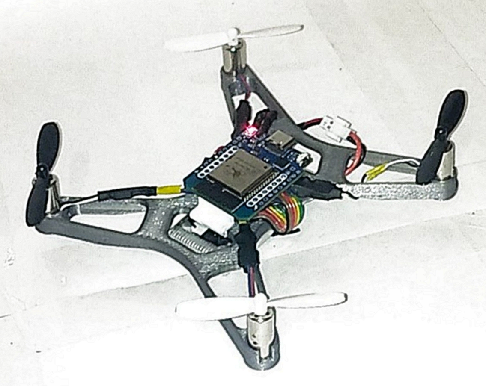
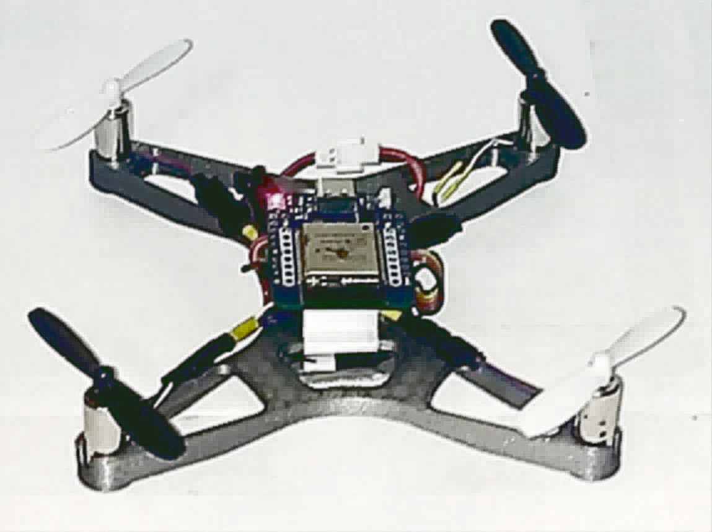
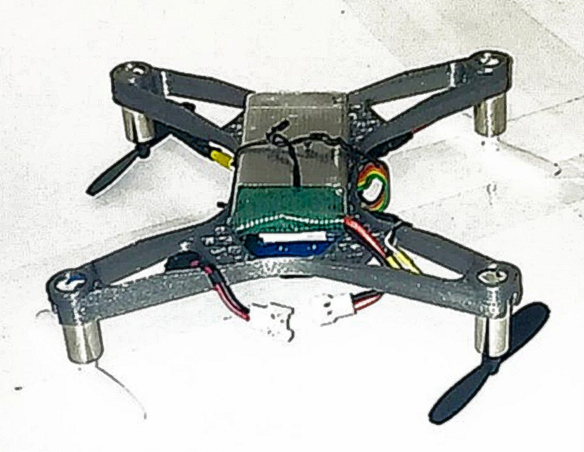

# Klyax

Фан‑версия образовательного квадрокоптера. Вдохновлено проектом [Flix](https://github.com/okalachev/flix).

> **Почему Klyax:** это "противоположный" токен — точка на поверхности 42‑мерной гиперсферы, глядящая в сторону flix.

## Особенности

- Собственная прошивка (PlatformIO): [Klyax-Firmware](./Klyax-Firmware) — много труда, много шероховатостей, зато своё и не летает.

## Рабочие каталоги проекта

| Каталог              | Описание                                                                                                                                                        |
|----------------------|-----------------------------------------------------------------------------------------------------------------------------------------------------------------|
| [Images](./Images)   | Общие изображения для репозитория                                                                                                                               |
| [Models](./Models)   | Содержит модели нативные для Компас‑3D, также имеет варианты 3mf (Orca Slicer), stp                                                                             |
| [Scripts](./Scripts) | Содержит shell скрипты вызывающие [klyax.py](./Scripts/klyax.py) - модуль для python для автоматизации проекта: генерация README, обработка рендеров, и другое. |

## Фото итераций

<blockquote>

### [Вариант 2025.10.10](./Images/Klyax-2025.10.10)

<table>

<tr>

</tr>

<tr>

</tr>

<tr>

</tr>

</table>

</blockquote>

